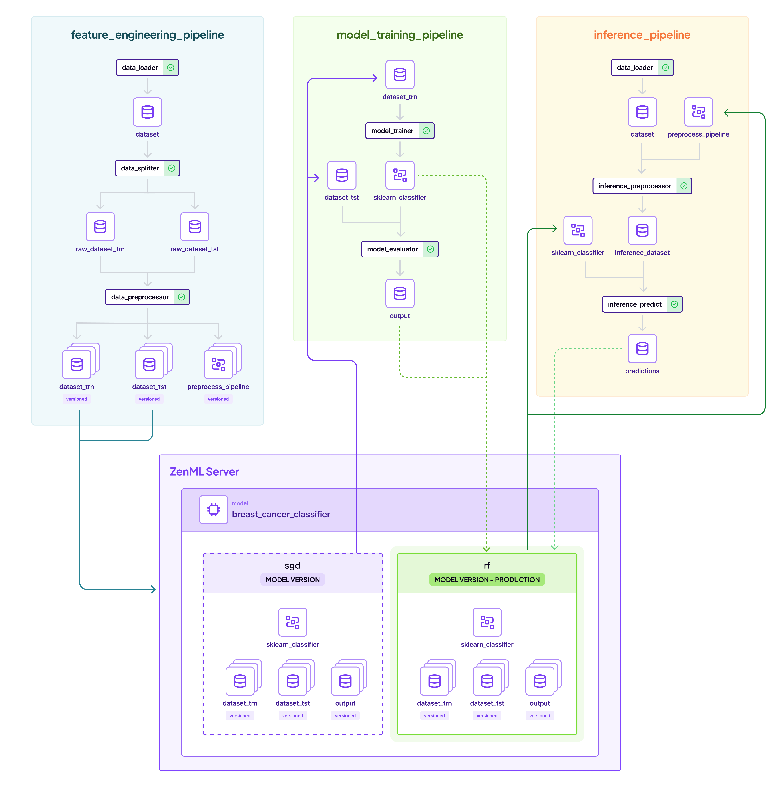

# :running: MLOps 101 with ZenML

Build your first MLOps pipelines with ZenML.

## :earth_americas: Overview

This starter project demonstrates a complete minimalist MLOps journey. It features:

- A feature engineering pipeline that loads data and prepares it for training.
- A training pipeline that loads the preprocessed dataset and trains a model.
- A batch inference pipeline that runs predictions on the trained model with new data.

Along the way we will also show you how to:

- Structure your code into MLOps pipelines
- Automatically version, track, and cache data, models, and other artifacts
- Transition your ML models from development to production



## 🏃 Run on Colab

You can use Google Colab to see ZenML in action, no signup / installation required!

<a href="https://colab.research.google.com/github/zenml-io/zenml/blob/main/examples/quickstart/run.ipynb" target="_parent"></a>

## :computer: Run Locally

To run locally, install ZenML and pull this quickstart:

```shell
# Install ZenML
pip install "zenml[server]"

# clone the ZenML repository
git clone https://github.com/zenml-io/zenml.git
cd zenml/examples/quickstart
```

### :arrow_forward: Run Locally
Now we're ready to start. You have two options for running the quickstart locally:

#### Option 1 (*Recommended*) - Interactively explore the quickstart using Jupyter Notebook:
```bash
pip install notebook
jupyter notebook
# open notebooks/quickstart.ipynb
```

#### Option 2 - Execute the whole ML pipeline from a Python script:
```bash
# Install required zenml integrations
zenml integration install sklearn -y

# Initialize ZenML
zenml init

# Start the ZenServer to enable dashboard access
zenml up

# Run the feature engineering pipeline
python run.py --feature-pipeline

# Run the training pipeline
python run.py --training-pipeline

# Run the training pipeline with versioned artifacts
python run.py --training-pipeline --train-dataset-version-name=1 --test-dataset-version-name=1

# Run the inference pipeline
python run.py --inference-pipeline
```

## :dart: Dashboard


## :bulb: Learn More

If you want to learn more about ZenML as a tool, then the 
[:page_facing_up: **ZenML Docs**](https://docs.zenml.io/) are the perfect place 
to get started.

Already have an MLOps stack in mind? ZenML most likely has
[**:link: Integrations**](https://docs.zenml.io/stacks-and-components/component-guide) 
for whatever tools you plan to use.

Also, make sure to join our <a href="https://zenml.io/slack" target="_blank">
    
    <b>Slack Community</b> 
</a> to become part of the ZenML family!